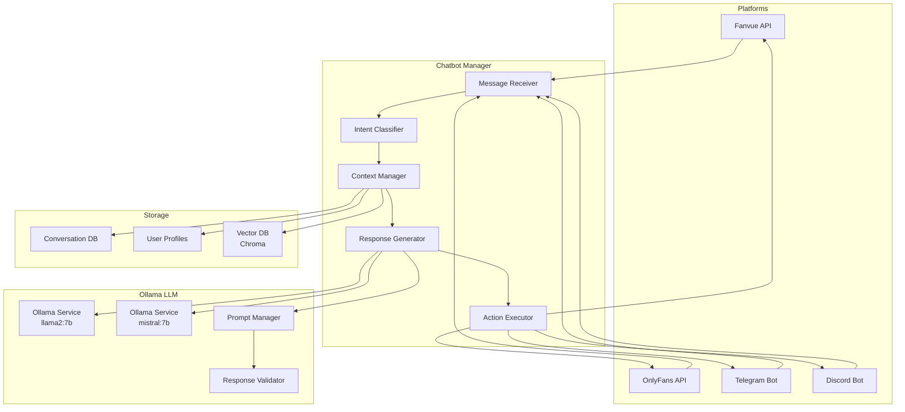
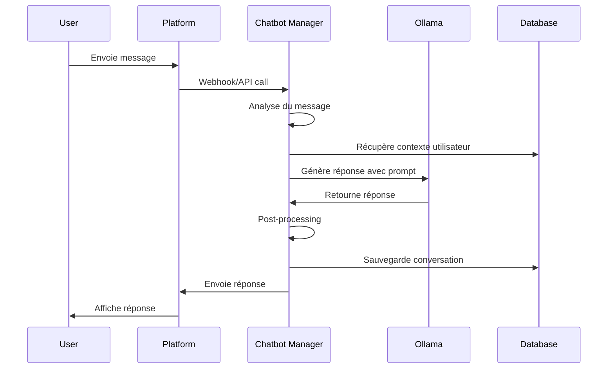
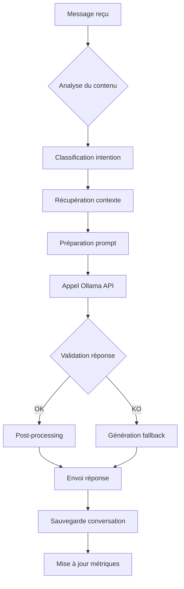

# 🤖 Module de Gestion des Chatbots

## 📋 Vue d'ensemble

Ce module gère les chatbots automatiques pour interagir avec les abonnés sur les plateformes de contenu (Fanvue, OnlyFans, Telegram, Discord) et automatiser les ventes de packs.

**Approche Open Source :** Ce module utilise **Ollama** comme LLM local pour les réponses intelligentes, offrant un contrôle total et une réduction des coûts.

---

## 🎯 Fonctionnalités principales

### 1. Réponses automatiques avec Ollama
- **Messages d'accueil** : Accueil automatique des nouveaux abonnés
- **Réponses contextuelles** : Réponses intelligentes avec LLM local
- **Vente automatique** : Proposition de packs selon les demandes
- **Support client** : Réponses aux questions fréquentes

### 2. Gestion des conversations
- **Suivi des conversations** : Historique complet des échanges
- **Classification des messages** : Catégorisation automatique
- **Escalade** : Transfert vers support humain si nécessaire
- **Personnalisation** : Adaptation selon le profil utilisateur

### 3. Intégration plateformes
- **Fanvue** : Intégration API officielle
- **OnlyFans** : Intégration via API ou web scraping
- **Telegram** : Bot Telegram personnalisé
- **Discord** : Bot Discord pour serveurs privés

---

## 🏗️ Architecture technique

### Architecture Ollama


### Flux de conversation avec Ollama


### Structure des données
```json
{
  "conversation_id": "uuid",
  "user_id": "user_123",
  "platform": "fanvue",
  "status": "active",
  "messages": [
    {
      "message_id": "msg_001",
      "timestamp": "2024-01-15T10:30:00Z",
      "sender": "user",
      "content": "Salut, tu as des photos de pieds ?",
      "type": "text",
      "intent": "feet_request"
    },
    {
      "message_id": "msg_002",
      "timestamp": "2024-01-15T10:30:30Z",
      "sender": "bot",
      "content": "Salut beauté 😘 Oui j'ai un pack pieds exclusif !",
      "type": "text",
      "intent": "feet_response",
      "generated_by": "ollama"
    }
  ],
  "user_profile": {
    "subscription_level": "premium",
    "purchase_history": ["pack_001", "pack_002"],
    "preferences": ["feet", "lingerie"],
    "last_activity": "2024-01-15T10:30:00Z"
  },
  "bot_state": {
    "current_intent": "feet_sales",
    "context": {
      "offered_pack": "feet_pack_001",
      "price": 10.00
    },
    "ollama_model": "llama2:7b",
    "conversation_history": "string"
  }
}
```

### Flux de conversation avec Ollama
```
1. Réception du message
   ├── Analyse du contenu
   ├── Classification de l'intention
   └── Mise à jour du contexte

2. Génération de la réponse (Ollama)
   ├── Préparation du prompt
   ├── Appel à Ollama API
   ├── Post-processing de la réponse
   └── Vérification des règles

3. Envoi de la réponse
   ├── Formatage du message
   ├── Envoi via API
   └── Log de l'action

4. Suivi post-réponse
   ├── Mise à jour des métriques
   ├── Gestion des actions
   └── Planification des follow-ups
```

---

## 🔧 Configuration Ollama

### Installation et Configuration
```yaml
# docker-compose.yml
services:
  ollama:
    image: ollama/ollama:latest
    ports:
      - "11434:11434"
    volumes:
      - ollama_data:/root/.ollama
    environment:
      - OLLAMA_HOST=0.0.0.0
    command: >
      sh -c "
        ollama pull llama2:7b &&
        ollama pull mistral:7b &&
        ollama serve
      "
```

### Modèles Ollama recommandés
```yaml
models:
  primary:
    name: "llama2:7b"
    description: "Modèle principal pour les réponses générales"
    parameters:
      temperature: 0.7
      top_p: 0.9
      max_tokens: 500
  
  sales:
    name: "mistral:7b"
    description: "Modèle spécialisé pour les ventes"
    parameters:
      temperature: 0.8
      top_p: 0.95
      max_tokens: 300
  
  support:
    name: "llama2:7b"
    description: "Modèle pour le support client"
    parameters:
      temperature: 0.5
      top_p: 0.8
      max_tokens: 400
```

### Configuration des prompts
```yaml
prompts:
  system_prompt: |
    Tu es une influenceuse NSFW française qui gère des conversations avec ses abonnés.
    Tu dois être chaleureuse, séductrice mais professionnelle.
    Tu vends des packs de photos (lingerie, pieds, nude artistique).
    Réponds toujours en français avec des emojis appropriés.
    Ne sois jamais vulgaire ou explicite, reste dans le cadre du glamour.

  context_template: |
    Contexte utilisateur:
    - Niveau d'abonnement: {subscription_level}
    - Historique d'achat: {purchase_history}
    - Préférences: {preferences}
    - Dernière activité: {last_activity}
    
    Conversation récente:
    {conversation_history}
    
    Message actuel: {current_message}
    
    Génère une réponse appropriée et engageante.

  sales_prompt: |
    L'utilisateur semble intéressé par {pack_type}.
    Propose-lui le pack {pack_id} au prix de {price}€.
    Sois persuasive mais pas insistante.
    Inclus des détails sur le contenu du pack.
```

---

## 🔧 Configuration des plateformes

### Fanvue API
```yaml
api_key: "your_fanvue_api_key"
api_secret: "your_fanvue_api_secret"
webhook_url: "https://your-domain.com/webhook/fanvue"

features:
  - auto_response
  - message_history
  - user_management
  - sales_tracking

limits:
  messages_per_minute: 10
  daily_messages: 1000
```

### OnlyFans API
```yaml
api_key: "your_onlyfans_api_key"
api_secret: "your_onlyfans_api_secret"
webhook_url: "https://your-domain.com/webhook/onlyfans"

features:
  - auto_response
  - content_management
  - subscription_management
  - analytics

limits:
  messages_per_minute: 5
  daily_messages: 500
```

### Telegram Bot
```yaml
bot_token: "your_telegram_bot_token"
webhook_url: "https://your-domain.com/webhook/telegram"

commands:
  - /start: "Accueil et présentation"
  - /packs: "Liste des packs disponibles"
  - /pricing: "Tarifs et promotions"
  - /help: "Aide et support"

features:
  - inline_keyboards
  - media_support
  - group_chat_support
```

### Discord Bot
```yaml
bot_token: "your_discord_bot_token"
guild_id: "your_guild_id"
webhook_url: "https://your-domain.com/webhook/discord"

channels:
  - name: "general"
    permissions: ["read", "send_messages"]
  - name: "nsfw"
    permissions: ["read", "send_messages", "attach_files"]

features:
  - slash_commands
  - role_management
  - moderation_tools
```

---

## 📝 Templates de réponses avec Ollama

### Messages d'accueil
```yaml
templates:
  welcome_new_subscriber:
    fanvue:
      prompt: |
        L'utilisateur vient de s'abonner. Accueille-le chaleureusement et propose-lui de découvrir tes packs.
        Sois séductrice mais pas vulgaire.
      ollama_model: "llama2:7b"
      delay: 30
      follow_up: "pieds_offer"
    
    onlyfans:
      prompt: |
        Nouvel abonné sur OnlyFans. Accueille-le et présente tes services.
        Mentionne tes packs exclusifs.
      ollama_model: "llama2:7b"
      delay: 45
      follow_up: "lingerie_offer"
```

### Réponses aux demandes
```yaml
templates:
  feet_request:
    prompt: |
      L'utilisateur demande des photos de pieds.
      Propose-lui le pack pieds exclusif à 10€.
      Sois séductrice et persuasive.
    ollama_model: "mistral:7b"
    actions:
      - type: "offer_pack"
        pack_id: "feet_pack_001"
        price: 10.00
      - type: "schedule_follow_up"
        delay: 3600
        message: "Tu as pensé à mon pack pieds ? 😏 Il est toujours disponible !"
    
  lingerie_request:
    prompt: |
      L'utilisateur s'intéresse aux photos lingerie.
      Propose le pack lingerie à 15€.
      Décris le contenu de manière attrayante.
    ollama_model: "mistral:7b"
    actions:
      - type: "offer_pack"
        pack_id: "lingerie_pack_001"
        price: 15.00
      - type: "schedule_follow_up"
        delay: 7200
        message: "Mon pack lingerie t'attend toujours... 🔥"
    
  nude_request:
    prompt: |
      L'utilisateur demande des photos nues.
      Propose le pack nude artistique à 25€.
      Reste dans le cadre du glamour.
    ollama_model: "mistral:7b"
    actions:
      - type: "offer_pack"
        pack_id: "nude_pack_001"
        price: 25.00
      - type: "schedule_follow_up"
        delay: 10800
        message: "Mon pack nude est toujours là si tu veux... 💋"
```

### Réponses de support
```yaml
templates:
  pricing_question:
    prompt: |
      L'utilisateur demande les tarifs.
      Liste tous tes packs avec leurs prix.
      Sois claire et professionnelle.
    ollama_model: "llama2:7b"
    
  technical_issue:
    prompt: |
      L'utilisateur a un problème technique.
      Sois empathique et propose de l'aider.
      Demande plus de détails.
    ollama_model: "llama2:7b"
    escalation: true
    
  spam_detection:
    prompt: |
      L'utilisateur envoie trop de messages.
      Sois polie mais ferme.
      Demande-lui d'être plus spécifique.
    ollama_model: "llama2:7b"
    cooldown: 300
```

---

## 🔄 Workflow automatisé avec Ollama

### Processus de réponse


### Gestion des ventes avec IA
```
1. Détection de l'intérêt
   ├── Analyse des mots-clés
   ├── Historique d'achat
   └── Comportement utilisateur

2. Proposition de pack (Ollama)
   ├── Génération de proposition personnalisée
   ├── Sélection du pack approprié
   └── Envoi du lien d'achat

3. Suivi de la vente
   ├── Confirmation d'achat
   ├── Envoi du contenu
   └── Demande de feedback

4. Follow-up intelligent
   ├── Remerciement personnalisé
   ├── Proposition d'autres packs
   └── Demande de recommandation
```

---

## 📊 Métriques et KPIs

### Métriques de performance
- **Taux de réponse** : Pourcentage de messages répondus
- **Temps de réponse** : Temps moyen de réponse (objectif < 20s)
- **Taux de conversion** : Pourcentage de ventes réussies
- **Satisfaction client** : Score de satisfaction
- **Performance Ollama** : Temps de génération, qualité des réponses

### Alertes automatiques
- **Temps de réponse élevé** : Plus de 30 secondes
- **Taux de conversion faible** : Moins de 5%
- **Spam détecté** : Trop de messages d'un utilisateur
- **Erreur Ollama** : Problème avec le LLM local
- **Erreur technique** : Problème avec l'API

---

## 🛠️ Intégration avec d'autres modules

### Module de gestion des ventes
- **Proposition de packs** : Intégration avec le catalogue
- **Suivi des transactions** : Confirmation des achats
- **Gestion des promotions** : Codes promo automatiques

### Module d'analytics
- **Métriques de conversation** : Envoi des statistiques
- **Analyse des comportements** : Patterns d'utilisation
- **Optimisation** : Suggestions d'amélioration

### Module de génération de contenu
- **Demande de contenu** : Génération selon les demandes
- **Personnalisation** : Contenu adapté aux préférences
- **Feedback** : Amélioration basée sur les retours

---

## 🔐 Sécurité et conformité

### Sécurité
- **Chiffrement** : Chiffrement des conversations
- **Authentification** : Vérification des utilisateurs
- **Audit** : Logs de toutes les interactions
- **Rate limiting** : Limitation des messages
- **Validation Ollama** : Filtrage des réponses inappropriées

### Conformité
- **RGPD** : Gestion des données personnelles
- **Age verification** : Vérification de l'âge
- **Content guidelines** : Respect des guidelines
- **Data retention** : Politique de conservation

---

## 🚀 Plan d'implémentation

### Phase 1 : MVP avec Ollama (3 semaines)
1. **Semaine 1** : Setup Ollama et intégration de base
2. **Semaine 2** : Templates de base et réponses automatiques
3. **Semaine 3** : Gestion des ventes et follow-ups

### Phase 2 : Extension (2 semaines)
1. **Semaine 4** : Intégration OnlyFans et Telegram
2. **Semaine 5** : Analytics et optimisation

### Phase 3 : Optimisation (1 semaine)
1. **Semaine 6** : A/B testing et amélioration des performances

---

## 📝 Exemples d'utilisation

### Configuration du chatbot avec Ollama
```python
# Exemple d'utilisation du module
from chatbot_manager import ChatbotManager

manager = ChatbotManager()

# Configuration pour Ollama
ollama_config = {
    "url": "http://ollama:11434",
    "model": "llama2:7b",
    "temperature": 0.7,
    "max_tokens": 500
}

# Configuration pour Fanvue
fanvue_config = {
    "api_key": "your_api_key",
    "auto_response": True,
    "sales_enabled": True,
    "ollama_config": ollama_config
}

manager.configure_platform("fanvue", fanvue_config)
```

### Gestion d'une conversation avec Ollama
```python
# Gestion automatique d'une conversation
conversation = manager.handle_message(
    platform="fanvue",
    user_id="user_123",
    message="Salut, tu as des photos de pieds ?",
    context={
        "subscription_level": "premium",
        "purchase_history": ["pack_001"],
        "ollama_model": "mistral:7b"
    }
)

# Réponse automatique générée par Ollama
response = conversation.get_response()
# "Salut beauté 😘 Oui j'ai un pack pieds exclusif avec 10 photos hyper sexy pour seulement 10€ !"
```

---

## 🔧 Configuration Docker

### Dockerfile pour le module chatbot
```dockerfile
FROM python:3.11-slim

WORKDIR /app

# Installation des dépendances
COPY requirements.txt .
RUN pip install -r requirements.txt

# Installation d'Ollama (si nécessaire)
RUN curl -fsSL https://ollama.ai/install.sh | sh

# Copie du code
COPY . .

# Exposition du port
EXPOSE 8000

# Commande de démarrage
CMD ["uvicorn", "main:app", "--host", "0.0.0.0", "--port", "8000"]
```

### Requirements pour Ollama
```txt
fastapi==0.104.1
uvicorn==0.24.0
requests==2.31.0
pydantic==2.5.0
python-dotenv==1.0.0
redis==5.0.1
psycopg2-binary==2.9.9
langchain==0.1.0
langchain-community==0.0.10
chromadb==0.4.18
sentence-transformers==2.2.2
```

---

*Document créé le : [Date]*
*Version : 2.0*
*Dernière mise à jour : [Date]*
*Approche : Open Source avec Ollama pour LLM local*
