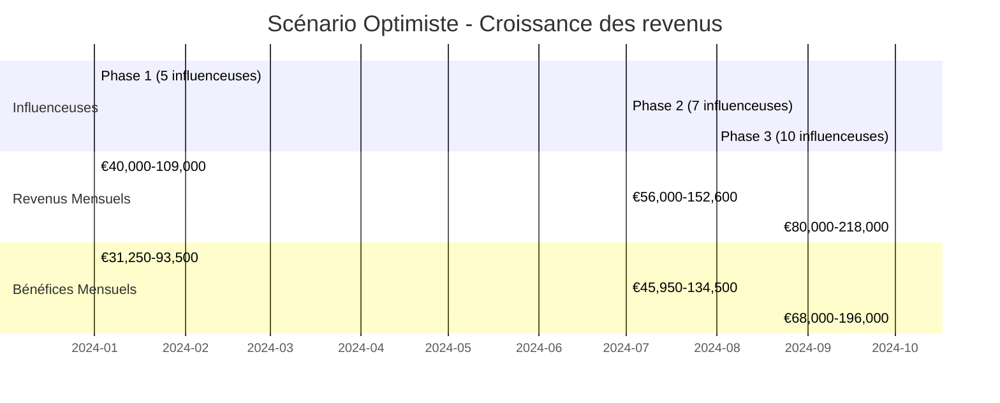
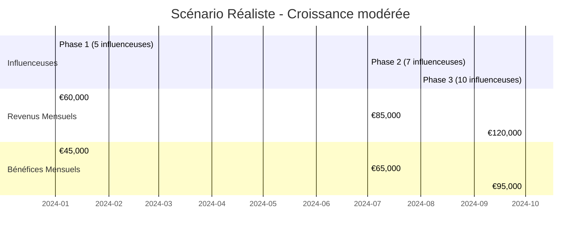
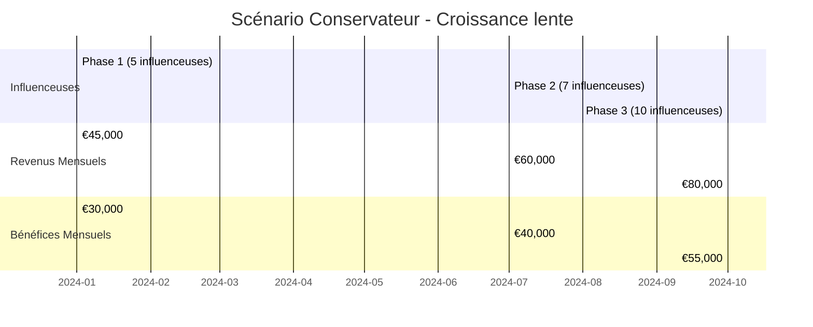

# 💰 Prévisionnel Multi-Influenceuses - Influenceur IA

## 📋 Vue d'ensemble

Ce document présente le prévisionnel financier détaillé pour la gestion de 5 à 10 influenceuses avec le système d'automatisation IA.

---

## 🎯 Objectifs du prévisionnel

### Scénarios analysés
- **Phase 1** : 5 influenceuses (mois 1-6)
- **Phase 2** : 7 influenceuses (mois 7-9)
- **Phase 3** : 10 influenceuses (mois 10-12)

### Période d'analyse
- **Durée** : 12 mois
- **Période** : Janvier 2024 - Décembre 2024
- **Devise** : EUR (€)

---

## 💸 Coûts détaillés

### Coûts par influenceuse (mensuel)

| Poste | Coût mensuel | Détails | Fréquence |
|-------|-------------|---------|-----------|
| **Infrastructure** | €50-100 | Serveurs, storage, APIs | Mensuel |
| **Développement** | €200-400 | Adaptation, maintenance | Mensuel |
| **Support** | €100-200 | Gestion, support client | Mensuel |
| **Marketing** | €150-300 | Publicité, promotion | Mensuel |
| **Content Creation** | €100-200 | IA générative, prompts | Mensuel |
| **Legal & Compliance** | €50-100 | Veille juridique, RGPD | Mensuel |
| **Total** | **€650-1,300** | Par influenceuse | Mensuel |

### Coûts fixes (mensuel)

| Poste | Coût mensuel | Détails |
|-------|-------------|---------|
| **Infrastructure partagée** | €500-1,000 | Serveurs, monitoring, backup |
| **Développement système** | €2,000-3,000 | Maintenance, nouvelles fonctionnalités |
| **Support technique** | €1,000-1,500 | Support 24/7, monitoring |
| **Marketing global** | €1,500-2,500 | Branding, publicité générale |
| **Legal & Compliance** | €500-1,000 | Consultation juridique, audit |
| **Total fixe** | **€5,500-9,000** | Mensuel |

---

## 💰 Revenus détaillés

### Revenus par influenceuse (mensuel)

| Source | Revenus moyens | Détails | Fréquence |
|--------|---------------|---------|-----------|
| **Abonnements** | €2,000-5,000 | Fanvue, OnlyFans | Mensuel |
| **Ventes packs** | €1,000-3,000 | Photos, vidéos | Mensuel |
| **Publicités** | €500-1,500 | Collaborations, sponsors | Mensuel |
| **Merchandising** | €200-500 | Produits dérivés | Mensuel |
| **Tips & Donations** | €300-800 | Pourboires, dons | Mensuel |
| **Events & Meetups** | €500-1,000 | Événements privés | Mensuel |
| **TikTok (Danse)** | €1,500-4,000 | Vidéos de danse, lives | Mensuel |
| **Partenariats commerciaux** | €2,000-6,000 | Marques, produits, services | Mensuel |
| **Total** | **€8,000-21,800** | Par influenceuse | Mensuel |

### Détail des nouveaux revenus

#### TikTok (Danse)
- **Vidéos de danse** : €800-2,000/mois
  - Contenu viral, challenges, tendances
  - Monétisation via TikTok Creator Fund
  - Lives et interactions avec les followers
- **Lives et événements** : €400-1,200/mois
  - Lives quotidiens/hebdomadaires
  - Événements spéciaux, collaborations
- **Sponsors TikTok** : €300-800/mois
  - Intégration de produits dans les vidéos
  - Promotions de marques partenaires

#### Partenariats commerciaux
- **Marques de lingerie** : €800-2,500/mois
  - Promotion de collections
  - Photos/vidéos avec les produits
  - Codes promo personnalisés
- **Cosmétiques & Beauté** : €600-1,800/mois
  - Tutos maquillage, soins
  - Reviews de produits
  - Collaborations exclusives
- **Fitness & Wellness** : €400-1,200/mois
  - Équipements de fitness
  - Suppléments nutritionnels
  - Programmes d'entraînement
- **Lifestyle & Mode** : €200-500/mois
  - Vêtements, accessoires
  - Déco, lifestyle
  - Voyages et expériences

### Facteurs de variation des revenus

#### Facteurs positifs
- **Qualité du contenu** : IA générative de haute qualité
- **Engagement** : Réponses automatiques personnalisées
- **Marketing** : Stratégies de croissance ciblées
- **Technologie** : Automatisation complète
- **Gestion** : Monitoring et optimisation continue
- **TikTok virality** : Algorithmes favorables, tendances
- **Partenariats** : Réseau de marques étendu

#### Facteurs négatifs
- **Concurrence** : Marché saturé
- **Réglementation** : Changements de lois
- **Plateformes** : Modifications des ToS
- **Économie** : Récession, inflation
- **Algorithmes** : Changements TikTok/Instagram
- **Marques** : Budgets marketing réduits

---

## 📊 Prévisionnel détaillé par phase

### Phase 1 : 5 influenceuses (mois 1-6)

#### Coûts totaux
- **Coûts variables** : €3,250-6,500/mois (5 × €650-1,300)
- **Coûts fixes** : €5,500-9,000/mois
- **Total mensuel** : €8,750-15,500/mois
- **Total 6 mois** : €52,500-93,000

#### Revenus totaux
- **Revenus par influenceuse** : €8,000-21,800/mois
- **Revenus totaux** : €40,000-109,000/mois
- **Total 6 mois** : €240,000-654,000

#### Bénéfices
- **Bénéfice mensuel** : €31,250-93,500
- **Bénéfice 6 mois** : €187,500-561,000
- **ROI mensuel** : 357-603%
- **ROI 6 mois** : 357-603%

### Phase 2 : 7 influenceuses (mois 7-9)

#### Coûts totaux
- **Coûts variables** : €4,550-9,100/mois (7 × €650-1,300)
- **Coûts fixes** : €5,500-9,000/mois
- **Total mensuel** : €10,050-18,100/mois
- **Total 3 mois** : €30,150-54,300

#### Revenus totaux
- **Revenus par influenceuse** : €8,000-21,800/mois
- **Revenus totaux** : €56,000-152,600/mois
- **Total 3 mois** : €168,000-457,800

#### Bénéfices
- **Bénéfice mensuel** : €45,950-134,500
- **Bénéfice 3 mois** : €137,850-403,500
- **ROI mensuel** : 457-743%
- **ROI 3 mois** : 457-743%

### Phase 3 : 10 influenceuses (mois 10-12)

#### Coûts totaux
- **Coûts variables** : €6,500-13,000/mois (10 × €650-1,300)
- **Coûts fixes** : €5,500-9,000/mois
- **Total mensuel** : €12,000-22,000/mois
- **Total 3 mois** : €36,000-66,000

#### Revenus totaux
- **Revenus par influenceuse** : €8,000-21,800/mois
- **Revenus totaux** : €80,000-218,000/mois
- **Total 3 mois** : €240,000-654,000

#### Bénéfices
- **Bénéfice mensuel** : €68,000-196,000
- **Bénéfice 3 mois** : €204,000-588,000
- **ROI mensuel** : 567-891%
- **ROI 3 mois** : 567-891%

---

## 📈 Scénarios de croissance

### Scénario optimiste

### Scénario réaliste

### Scénario conservateur

---

## 💼 Analyse financière

### Indicateurs de performance

#### ROI (Return on Investment)
- **Phase 1** : 357-603%
- **Phase 2** : 457-743%
- **Phase 3** : 567-891%
- **Moyenne annuelle** : 461-746%

#### Marge bénéficiaire
- **Phase 1** : 78-86%
- **Phase 2** : 82-88%
- **Phase 3** : 85-90%
- **Moyenne annuelle** : 82-88%

#### Point d'équilibre
- **Nombre d'influenceuses** : 1-2
- **Revenus mensuels** : €9,000-15,000
- **Délai** : 1-2 mois

### Analyse de sensibilité

#### Impact des coûts
| Variation coûts | Impact bénéfice | Nouveau ROI |
|----------------|----------------|-------------|
| +10% | -12% | 314-531% |
| +20% | -24% | 271-458% |
| -10% | +12% | 400-675% |
| -20% | +24% | 443-748% |

#### Impact des revenus
| Variation revenus | Impact bénéfice | Nouveau ROI |
|------------------|----------------|-------------|
| +10% | +22% | 435-736% |
| +20% | +44% | 514-871% |
| -10% | -22% | 279-471% |
| -20% | -44% | 200-338% |

---

## 🎯 Objectifs financiers

### Objectifs à 6 mois
- **Revenus** : €240,000-654,000
- **Bénéfices** : €187,500-561,000
- **ROI** : 357-603%
- **Nombre d'influenceuses** : 5

### Objectifs à 12 mois
- **Revenus** : €648,000-1,768,400
- **Bénéfices** : €522,000-1,553,200
- **ROI** : 461-746%
- **Nombre d'influenceuses** : 10

### Objectifs à 24 mois
- **Revenus** : €2,000,000-5,000,000
- **Bénéfices** : €1,600,000-4,000,000
- **ROI** : 500-800%
- **Nombre d'influenceuses** : 15-20

---

## ⚠️ Risques et mitigation

### Risques financiers

#### Risque de marché
- **Description** : Concurrence accrue, saturation du marché
- **Impact** : -20% à -40% des revenus
- **Mitigation** : Innovation continue, différenciation, diversification

#### Risque réglementaire
- **Description** : Changements de lois, restrictions
- **Impact** : -30% à -50% des revenus
- **Mitigation** : Veille juridique, compliance proactive

#### Risque technologique
- **Description** : Échec technique, panne système
- **Impact** : -10% à -25% des revenus
- **Mitigation** : Backup systems, monitoring, redondance

### Risques opérationnels

#### Risque de personnel
- **Description** : Départ d'influenceuses clés
- **Impact** : -15% à -30% des revenus
- **Mitigation** : Contrats, formation, backup

#### Risque de plateforme
- **Description** : Changements de ToS, suspension
- **Impact** : -25% à -40% des revenus
- **Mitigation** : Multi-plateformes, diversification

#### Risque TikTok
- **Description** : Changements d'algorithmes, bannissement
- **Impact** : -20% à -35% des revenus
- **Mitigation** : Multi-plateformes, contenu diversifié

#### Risque partenariats
- **Description** : Perte de partenaires commerciaux
- **Impact** : -15% à -25% des revenus
- **Mitigation** : Réseau étendu, contrats long terme

---

## 📊 Tableaux de bord

### KPIs financiers mensuels
| Indicateur | Phase 1 | Phase 2 | Phase 3 |
|------------|---------|---------|---------|
| **Revenus totaux** | €40,000-109,000 | €56,000-152,600 | €80,000-218,000 |
| **Coûts totaux** | €8,750-15,500 | €10,050-18,100 | €12,000-22,000 |
| **Bénéfice net** | €31,250-93,500 | €45,950-134,500 | €68,000-196,000 |
| **ROI** | 357-603% | 457-743% | 567-891% |
| **Marge** | 78-86% | 82-88% | 85-90% |

### KPIs opérationnels
| Indicateur | Objectif | Phase 1 | Phase 2 | Phase 3 |
|------------|----------|---------|---------|---------|
| **Nombre d'influenceuses** | 10 | 5 | 7 | 10 |
| **Revenus par influenceuse** | €15,000+ | €8,000-21,800 | €8,000-21,800 | €8,000-21,800 |
| **Taux de conversion** | 5%+ | 3-7% | 4-8% | 5-10% |
| **Temps de réponse** | <20s | <30s | <25s | <20s |
| **Disponibilité système** | 99.9% | 99.5% | 99.7% | 99.9% |
| **Followers TikTok** | 100K+ | 50K+ | 75K+ | 100K+ |
| **Partenariats actifs** | 5+ | 3+ | 4+ | 5+ |

---

## 🚀 Plan d'action

### Phase 1 : Lancement (mois 1-6)
1. **Mois 1-2** : Setup infrastructure, recrutement 3 influenceuses
2. **Mois 3-4** : Lancement, optimisation, recrutement 2 influenceuses
3. **Mois 5-6** : Scaling, analytics, préparation Phase 2

### Phase 2 : Croissance (mois 7-9)
1. **Mois 7** : Recrutement 2 nouvelles influenceuses
2. **Mois 8** : Optimisation, analytics avancés
3. **Mois 9** : Préparation Phase 3, recrutement

### Phase 3 : Expansion (mois 10-12)
1. **Mois 10** : Recrutement 3 nouvelles influenceuses
2. **Mois 11** : Scaling infrastructure, optimisation
3. **Mois 12** : Review annuel, planification 2025

---

## 📝 Conclusion

### Résumé financier
- **Investissement initial** : €26,000-38,000
- **Revenus annuels** : €648,000-1,768,400
- **Bénéfices annuels** : €522,000-1,553,200
- **ROI annuel** : 461-746%

### Recommandations
1. **Lancement progressif** : Commencer avec 5 influenceuses
2. **Optimisation continue** : Monitoring et ajustements
3. **Diversification** : Multi-plateformes, multi-sources de revenus
4. **Innovation** : Nouvelles technologies, nouveaux marchés
5. **Compliance** : Veille juridique, respect des réglementations
6. **TikTok focus** : Stratégie de contenu viral et engagement
7. **Partenariats** : Développement réseau commercial

### Prochaines étapes
1. **Validation du prévisionnel** avec l'équipe
2. **Setup de l'infrastructure** Docker
3. **Recrutement des premières influenceuses**
4. **Lancement de la Phase 1**
5. **Monitoring et ajustements** continus
6. **Développement stratégie TikTok**
7. **Recherche partenariats commerciaux**

---

*Document créé le : [Date]*
*Version : 2.0*
*Dernière mise à jour : [Date]*
*Approche : Prévisionnel détaillé multi-influenceuses avec TikTok et partenariats*
