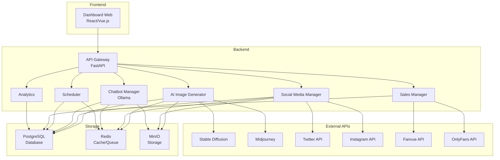
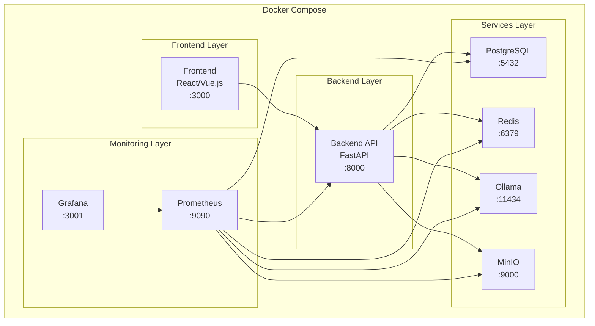
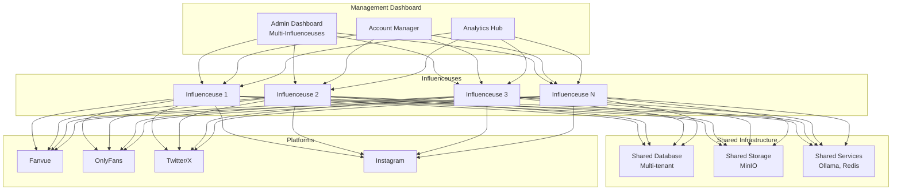
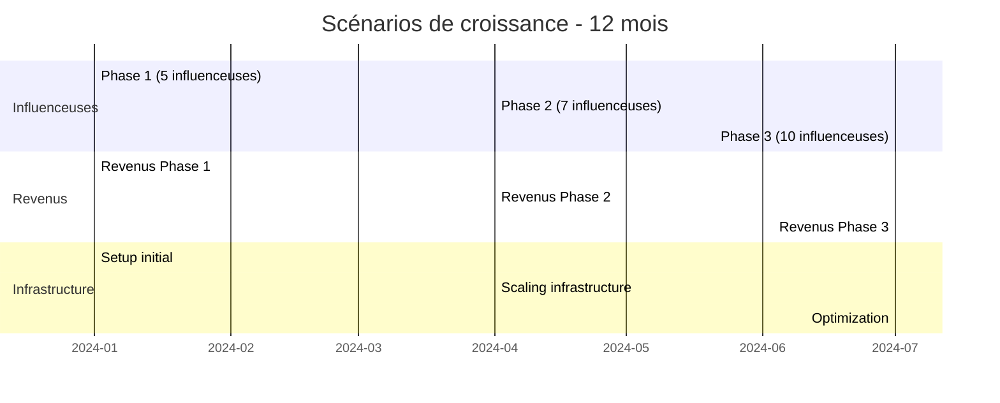

# 🚀 Influenceur IA - Système d'Automatisation Complet

## 📋 Vue d'ensemble

Ce projet vise à automatiser complètement la gestion d'une présence d'influenceuse sur les plateformes NSFW (Fanvue, OnlyFans, etc.) en utilisant l'IA pour la génération de contenu, la gestion des réseaux sociaux, et l'automatisation des ventes.

**Approche Open Source :** Ce projet privilégie les solutions open source pour maximiser la flexibilité, réduire les coûts et maintenir le contrôle total sur l'infrastructure.

---

## 🎯 Objectifs du projet

### 🎨 Génération automatique de contenu
- **Images NSFW** : Génération automatique avec Stable Diffusion, Midjourney
- **Vidéos courtes** : Création de clips avec Pika Labs
- **Textes** : Génération de captions avec GPT
- **Voix** : Synthèse vocale avec ElevenLabs

### 📱 Gestion des réseaux sociaux
- **Publication automatique** : Twitter/X, Instagram, Reddit
- **Planification intelligente** : Calendrier optimisé
- **Engagement automatique** : Réponses, likes, commentaires

### 🤖 Chatbots et ventes (avec Ollama)
- **Réponses automatiques** : Accueil, ventes, support (LLM local)
- **Gestion des conversations** : Suivi, personnalisation
- **Ventes automatisées** : Packs, promotions, follow-ups

### 📊 Analytics et monitoring
- **Métriques en temps réel** : Performance, revenus, engagement
- **Rapports automatiques** : Quotidiens, hebdomadaires, mensuels
- **Alertes intelligentes** : Problèmes, opportunités

---

## 🏗️ Architecture du système

### Architecture générale


### Architecture Docker


### Architecture Multi-Influenceuses


### Architecture générale
```
┌─────────────────┐    ┌─────────────────┐    ┌─────────────────┐
│   Frontend      │    │   Backend       │    │   External      │
│   (Dashboard)   │◄──►│   (FastAPI)     │◄──►│   APIs          │
└─────────────────┘    └─────────────────┘    └─────────────────┘
                              │
                              ▼
                       ┌─────────────────┐
                       │   Database      │
                       │   (PostgreSQL)  │
                       └─────────────────┘
                              │
                              ▼
                       ┌─────────────────┐
                       │   Storage       │
                       │   (MinIO/S3)    │
                       └─────────────────┘
```

### Architecture Docker
```
┌─────────────────────────────────────────────────────────────┐
│                    Docker Compose                           │
├─────────────────┬─────────────────┬─────────────────────────┤
│   Frontend      │   Backend       │   Services              │
│   (React/Vue)   │   (FastAPI)     │   (Ollama, Redis, etc.) │
├─────────────────┼─────────────────┼─────────────────────────┤
│   Database      │   Storage       │   Monitoring            │
│   (PostgreSQL)  │   (MinIO)       │   (Prometheus/Grafana)  │
└─────────────────┴─────────────────┴─────────────────────────┘
```

---

## 📁 Structure du projet

```
Influenceur_IA/
├── 📄 pack_influenceuse_fanvue_nsfl.md          # Guide original
├── 📄 architecture_automatisation.md            # Architecture générale
├── 📁 modules/                                  # Documentation des modules
│   ├── 📄 ai_image_generator.md                # Module génération d'images
│   ├── 📄 social_media_manager.md              # Module réseaux sociaux
│   ├── 📄 chatbot_manager.md                   # Module chatbots (Ollama)
│   ├── 📄 scheduler.md                         # Module planification
│   ├── 📄 sales_manager.md                     # Module ventes
│   └── 📄 analytics.md                         # Module analytics
├── 📁 src/                                      # Code source (futur)
├── 📁 config/                                   # Configuration
├── 📁 docs/                                     # Documentation technique
├── 📁 deployment/                               # Déploiement Docker
└── 📁 docker/                                   # Configuration Docker
```

---

## 🔄 Flux de travail automatisé

### Flux quotidien

```mermaid
gantt
    title Flux de travail quotidien
    dateFormat  HH:mm
    axisFormat %H:%M
    
    section Génération
    Images lingerie     :06:00, 30m
    Images pieds        :06:30, 30m
    Images nude         :07:00, 30m
    Post-processing     :07:30, 30m
    
    section Planification
    Organisation        :08:00, 30m
    Programmation       :08:30, 30m
    
    section Publication
    Posts réseaux sociaux :10:00, 15m
    Upload plateformes   :15:00, 15m
    Engagement          :20:00, 15m
    
    section Monitoring
    Suivi métriques     :continuous
    Réponses messages   :continuous
    Gestion ventes      :continuous
```


### 📅 Planning quotidien
```
6h00 - 8h00 : Génération de contenu
├── 6h00-6h30 : Images lingerie (2-3 photos)
├── 6h30-7h00 : Images pieds (1-2 photos)
├── 7h00-7h30 : Images nude artistique (1-2 photos)
└── 7h30-8h00 : Post-processing et organisation

8h00 - 9h00 : Planification
├── Organisation du contenu
├── Programmation des posts
└── Vérification des interactions

10h00, 15h00, 20h00 : Publication
├── Posts sur réseaux sociaux
├── Upload sur plateformes
└── Engagement automatique

Monitoring continu
├── Suivi des métriques
├── Réponses aux messages (via Ollama)
└── Gestion des ventes
```

### 📊 Planning hebdomadaire
```
Lundi : Planification de la semaine + Lingerie (5 images)
Mardi : Pieds (3 images) + Engagement
Mercredi : Nude artistique (3 images) + Analytics
Jeudi : Lingerie (5 images) + Promotions
Vendredi : Pieds (3 images) + Analyse des performances
Samedi : Contenu spécial weekend
Dimanche : Repos + Préparation semaine suivante
```

---

## 🏢 Architecture Multi-Influenceuses

### Vue d'ensemble
Le système peut être étendu pour gérer plusieurs influenceuses (5-10) avec une architecture multi-tenant.

### Prévisionnel Multi-Influenceuses (5-10 influenceuses)

#### Coûts par influenceuse (mensuel)
| Poste | Coût mensuel | Détails |
|-------|-------------|---------|
| **Infrastructure** | $50-100 | Serveurs, storage, APIs |
| **Développement** | $200-400 | Adaptation, maintenance |
| **Support** | $100-200 | Gestion, support client |
| **Marketing** | $150-300 | Publicité, promotion |
| **Total** | **$500-1,000** | Par influenceuse |

#### Revenus par influenceuse (mensuel)
| Source | Revenus moyens | Détails |
|--------|---------------|---------|
| **Abonnements** | $2,000-5,000 | Fanvue, OnlyFans |
| **Ventes packs** | $1,000-3,000 | Photos, vidéos |
| **Publicités** | $500-1,500 | Collaborations |
| **Merchandising** | $200-500 | Produits dérivés |
| **Total** | **$3,700-10,000** | Par influenceuse |

#### Prévisionnel détaillé

##### Pour 5 influenceuses
- **Coûts totaux** : $2,500-5,000/mois
- **Revenus totaux** : $18,500-50,000/mois
- **Bénéfice net** : $16,000-45,000/mois
- **ROI mensuel** : 640-900%

##### Pour 10 influenceuses
- **Coûts totaux** : $5,000-10,000/mois
- **Revenus totaux** : $37,000-100,000/mois
- **Bénéfice net** : $32,000-90,000/mois
- **ROI mensuel** : 640-900%

#### Scénarios de croissance


---

## 🛠️ Technologies utilisées (OPEN SOURCE)

### Backend
- **Framework** : FastAPI (Python) - Open Source
- **Base de données** : PostgreSQL + Redis - Open Source
- **Storage** : MinIO (alternative open source à S3) - Open Source
- **Queue** : Celery + Redis - Open Source
- **Monitoring** : Prometheus + Grafana - Open Source

### Frontend
- **Framework** : React ou Vue.js - Open Source
- **Dashboard** : Streamlit (Python) - Open Source
- **Charts** : Plotly ou Chart.js - Open Source

### Chatbot & IA
- **LLM Local** : **Ollama** - Open Source
- **Framework LLM** : LangChain - Open Source
- **Embeddings** : Sentence Transformers - Open Source
- **Vector DB** : Chroma ou Qdrant - Open Source

### DevOps & Conteneurisation
- **Containerisation** : **Docker** + Docker Compose - Open Source
- **Orchestration** : Kubernetes (optionnel) - Open Source
- **CI/CD** : GitHub Actions - Open Source
- **Monitoring** : Sentry, LogRocket - Open Source
- **Logging** : ELK Stack (Elasticsearch, Logstash, Kibana) - Open Source

---

## 🐳 Architecture Docker

### Services principaux
```yaml
# Services Docker Compose
services:
  frontend:          # Interface utilisateur
  backend:           # API FastAPI
  postgres:          # Base de données
  redis:             # Cache et queue
  ollama:            # LLM local
  minio:             # Storage
  prometheus:        # Monitoring
  grafana:           # Dashboards
```

### Avantages de l'approche Docker
- **Portabilité** : Déploiement identique sur tous les environnements
- **Scalabilité** : Facile d'ajouter de nouveaux services
- **Isolation** : Chaque service dans son propre conteneur
- **Gestion des dépendances** : Configuration centralisée
- **Développement** : Environnement de dev identique à la prod

---

## 💰 Estimation des coûts (Réduits avec Open Source)

### Infrastructure (mensuel)
- **Serveurs** : $100-300/mois (réduction grâce à Docker)
- **Storage** : $30-150/mois (MinIO vs S3)
- **APIs** : $50-200/mois (réduction avec Ollama local)
- **Monitoring** : $20-50/mois (solutions open source)

### Développement
- **Phase 1** : $8,000-12,000
- **Phase 2** : $12,000-16,000
- **Phase 3** : $6,000-10,000

### Total estimé : $26,000-38,000 + $200-700/mois
**Économies réalisées :** ~$7,000-9,000 + $200-400/mois grâce aux solutions open source

### Prévisionnel Multi-Influenceuses
- **5 influenceuses** : $16,000-45,000/mois de bénéfice
- **10 influenceuses** : $32,000-90,000/mois de bénéfice
- **ROI mensuel** : 640-900%

---

## 🚀 Plan de déploiement

### Phase 1 : MVP avec Docker (4-6 semaines)
1. **Semaine 1-2** : Setup infrastructure Docker de base
2. **Semaine 3-4** : Module de génération d'images
3. **Semaine 5-6** : Module de publication sociale

### Phase 2 : Extension avec Ollama (6-8 semaines)
1. **Semaine 7-8** : Module de chatbot avec Ollama
2. **Semaine 9-10** : Module de gestion des ventes
3. **Semaine 11-12** : Module d'analytics

### Phase 3 : Optimisation (4-6 semaines)
1. **Semaine 13-14** : A/B testing et optimisation
2. **Semaine 15-16** : Monitoring avancé
3. **Semaine 17-18** : Documentation et formation

### Phase 4 : Multi-Influenceuses (6-8 semaines)
1. **Semaine 19-20** : Architecture multi-tenant
2. **Semaine 21-22** : Interface de gestion centralisée
3. **Semaine 23-24** : Scaling et optimisation

---

## 🔐 Sécurité et conformité

### Sécurité
- **Chiffrement** : AES-256 pour les données sensibles
- **Authentification** : JWT + OAuth2
- **Autorisation** : RBAC (Role-Based Access Control)
- **Audit** : Logs complets de toutes les actions

### Conformité
- **RGPD** : Gestion des données personnelles
- **COPPA** : Protection des mineurs
- **Plateformes** : Respect des ToS
- **Paiements** : PCI DSS compliance

---

## 📊 Métriques et KPIs

### Métriques de contenu
- **Engagement** : Likes, commentaires, partages
- **Reach** : Vues, impressions, followers
- **Conversion** : Clics vers plateformes, abonnements

### Métriques financières
- **Revenus** : Chiffre d'affaires quotidien/mensuel
- **ROI** : Retour sur investissement publicitaire
- **LTV** : Lifetime Value des abonnés

### Métriques techniques
- **Performance** : Temps de génération, disponibilité
- **Erreurs** : Taux d'erreur, temps de résolution
- **Scalabilité** : Charge, ressources utilisées

---

## ⚠️ Risques et mitigation

### Risques techniques
- **APIs instables** : Fallbacks et retry logic
- **Rate limiting** : Gestion intelligente des quotas
- **Downtime** : Monitoring et alertes proactives

### Risques business
- **Changements de ToS** : Monitoring des plateformes
- **Concurrence** : Innovation continue
- **Réglementation** : Veille juridique

### Risques opérationnels
- **Sécurité** : Audit régulier et tests de pénétration
- **Compliance** : Consultation juridique
- **Scalabilité** : Architecture modulaire

---

## 📝 Prochaines étapes

1. **Validation de l'architecture** avec l'équipe
2. **Setup Docker** de l'environnement de développement
3. **Prototypage** des modules critiques (notamment Ollama)
4. **Estimation détaillée** des coûts et délais
5. **Planification** du développement
6. **Architecture multi-influenceuses** (Phase 4)

---

## 🤝 Contribution

Ce projet est en phase de conception. Les contributions sont les bienvenues :

1. **Review** de l'architecture
2. **Suggestions** d'amélioration
3. **Prototypage** de modules
4. **Documentation** technique

---

## 📞 Contact

Pour toute question ou suggestion concernant ce projet :

- **Email** : [votre-email@domain.com]
- **GitHub** : [votre-github]
- **Discord** : [votre-discord]

---

*Document créé le : [Date]*
*Version : 2.0*
*Dernière mise à jour : [Date]*
*Approche : Open Source First avec Docker et Ollama*
